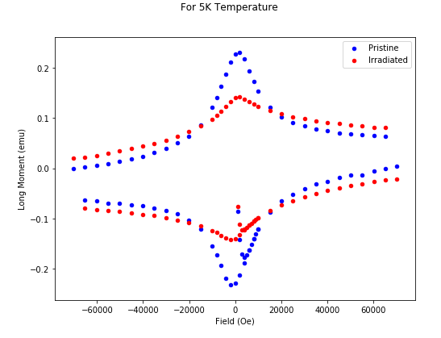
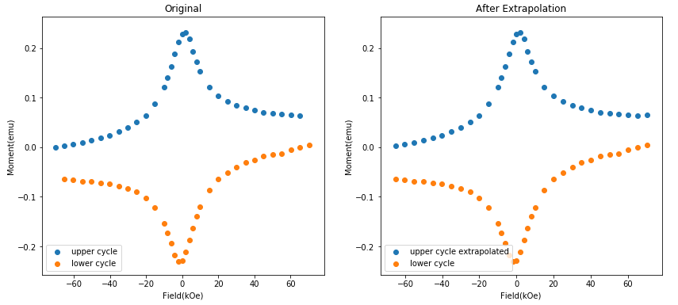

# Squid_data_analysis using python


## Workflow
* Reading .dat file.
* Extracting necessary information.
* Ploting magnetization vs applied field for a sample before and after irradiation.
* Rearranging data for two cycles of magnetization.
* Fitting the data and doing necessary Extrapolation at the highest magnetic field applied.


## The raw data
* The first 30 rows are information about parameters(which is unnecessary for further analysis.)
*  It has about 30 fields and 100 rows of information to be extracted.

## Importing libraries
```python
import pandas as pd 
import scipy
import numpy as np
import matplotlib.pyplot as plt 
%matplotlib inline
````
## Creating a function to plot Magnetization vs Applied field for specific temperature.

```python
def Mag_Plot(temp,pre_data,post_data):
    pristine=pre_data
    irradiated=post_data
    Pristine=pd.read_table(pristine,skiprows=30,sep=',',usecols=[2,4])
    Irradiated=pd.read_table(irradiated,skiprows=30,sep=',',usecols=[2,4])
    fig=plt.figure(1,(8,6))
    fig.suptitle('For '+str(temp)+ 'K Temperature')
    ax=fig.add_subplot(111)
    Pristine.plot.scatter('Field (Oe)', 'Long Moment (emu)',color='b', label='Pristine',ax=ax)
    Irradiated.plot.scatter('Field (Oe)','Long Moment (emu)',color='r',label='Irradiated', ax=ax)
```
## Creating the plot for pristine and irradiated data at 5 K temperature


<strong>
As you can see in the plot above, the applied field (horizontal axis) is from around -70k oe to 70k oe. But the left side does not have magnetization data for the lower cycle for -70k oe. Also, on the right side, it does not have magnetization data for the upper cycle for 70k oe. For these missing data, we need to fit the data and carry out extrapolation.
</strong>

## Import interpolate.rbf method from scipy for interpolation
Radial basis function interpolation is a method of interpolating functions or data using a weighted sum of radial basis functions. One of the most widely used radial basis function is the Gaussian function which has been shown to be universal enough to approximate a wide variety of functions.

```python
from scipy.interpolate.rbf import Rbf
```

```python
  def Interpolation(datapath):
    data=pd.read_table(datapath,sep=',', skiprows=30,usecols=[2,4])
#     separating two cycles of magnetization B cycle and D cycle
    A=data[10:22]
    B=data[22:56]
    C=data[56:]
    D = C.append(A)
    B=B[::-1]
#     converting units of applied magnetic field to kOe and changing datatype to numpy array.
    H1=np.array(B['Field (Oe)'])*1/1000
    M1=np.array(B['Long Moment (emu)'])
    H2=np.array(D['Field (Oe)'])*1/1000
    M2=np.array(D['Long Moment (emu)'])
#     fitting the data and making prediction 
    rbf_adj = Rbf(H1, M1, function='linear')
    M_predict = rbf_adj(H2)
  ```
    
    return M2,M1,M_predict,H2,H1
<strong>
  Let's see how well we can fit the data. We can change the rbf function from 'linear' to some other type to see if the other function fits better. I have found linear function giving better fitting.
</strong>

```python
M2,M1,M_predict,H2,H1=Interpolation(pre_data)
M2_I,M1_I,M_predict_I,H2_I,H1_I=Interpolation(post_data)
```
```python
fig=plt.figure(1,(14,6))
ax1=fig.add_subplot(1,2,1)
ax2=fig.add_subplot(1,2,2)
ax1.scatter(H1,M1,label='upper cycle')
ax1.scatter(H2,M2,label='lower cycle')
ax2.scatter(H2,M_predict,label='upper cycle extrapolated')
ax2.scatter(H2,M2,label='lower cycle')
ax1.set_title("Original")
ax1.set_xlabel("Field(kOe)")
ax1.set_ylabel("Moment(emu)")
ax2.set_title("After Extrapolation")
ax2.set_xlabel("Field(kOe)")
ax2.set_ylabel("Moment(emu)")
ax1.legend(loc=3)
ax2.legend(loc=3)
```

